<div align="center">

```
  ____   _  ____   ___  ____  _   _    _    __  __   _  __    _    __  __ _____ ____  _   _ 
 |  _ \ | ||  _ \ |_ _|/ ___|| | | |  / \  |  \/  | | |/ /   / \  |  \/  | ____/ ___|| | | |
 | | | || || |_) | | | \___ \| |_| | / _ \ | |\/| | | ' /   / _ \ | |\/| |  _| \___ \| |_| |
 | |_| || ||  _ <  | |  ___) |  _  |/ ___ \| |  | | | . \  / ___ \| |  | | |___ ___) |  _  |
 |____/ |_||_| \_\|___||____/|_| |_/_/   \_\_|  |_| |_|\_\/_/   \_\_|  |_|_____|____/|_| |_|
```

  *CSE Student & Full-Stack Developer in Training · Building high-impact web applications & solving DSA problems*

</div>

<br />

### <code>dirisham@github ~ $ ./contributions.sh</code>

<p align="center">
  
</p>

<br />

### <code>dirisham@github ~ $ whoami</code>

<table width="100%" border="0" cellspacing="0" cellpadding="0">
  <tr>
    <td width="48%" align="center" valign="top">
      
    </td>
    <td width="52%" align="center" valign="top">
      
    </td>
  </tr>
</table>

<br />

### <code>dirisham@github ~ $ ls projects</code>

| Project | Description | Tech Stack | Status |
| :--- | :--- | :--- | :---: |
| 🚀 [**FacuLynk**](https://github.com/DirishamKamesh/FacuLynk) | Full-stack web portal bridging communication & workflow | `JavaScript` `HTML5` `CSS3` `Node.js` | ⚡ Active |
| 🤝 [**HackMate**](https://github.com/DirishamKamesh/HackMate) | Collaborative platform for finding hackathon teammates & projects | `React.js` `JavaScript` `Node.js` | ⚡ Active |
| 📚 [**My_FSD_journey**](https://github.com/DirishamKamesh/My_FSD_journey) | Hands-on repository tracking full-stack Web Development progress | `HTML5` `CSS3` `JavaScript` `Node.js` | 📈 Ongoing |
| ☕ [**DSA_questions_java**](https://github.com/DirishamKamesh/DSA_questions_java) | Structured Data Structures & Algorithms solutions in Java | `Java` `DSA` | 🎯 Practicing |
| 🧩 [**neetcode-submissions**](https://github.com/DirishamKamesh/neetcode-submissions) | Problem-solving repository for NeetCode & LeetCode challenges | `Java` `C` `Algorithms` | 🎯 Practicing |

<br />

### <code>dirisham@github ~ $ skills</code>

```
┌─────────────────────────────────────────────────────────────────────────┐
│ TECH STACK & COMPETENCIES                                               │
└─────────────────────────────────────────────────────────────────────────┘
```

#### 💻 Languages


#### 🎨 Frontend


#### ⚙️ Backend


#### 🗄️ Database & Cloud Services


#### 🛠️ Tools & Deployment


#### 🚀 Currently Learning & Expanding


#### 🔮 Future Focus


<br />

---

> `> Build. Break. Debug. Repeat.`

<br />

<p align="center">
  <a href="https://github.com/DirishamKamesh">
    
  </a>
</p>
